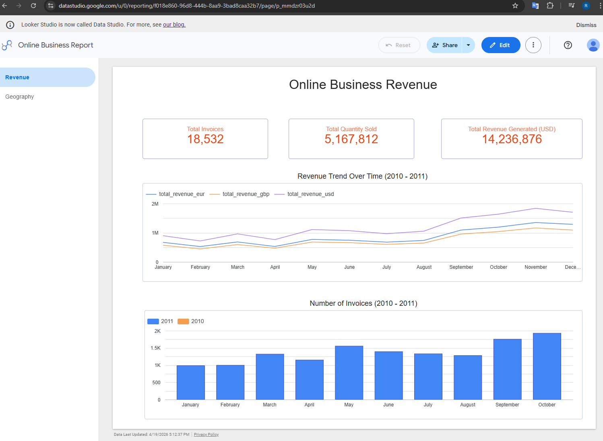
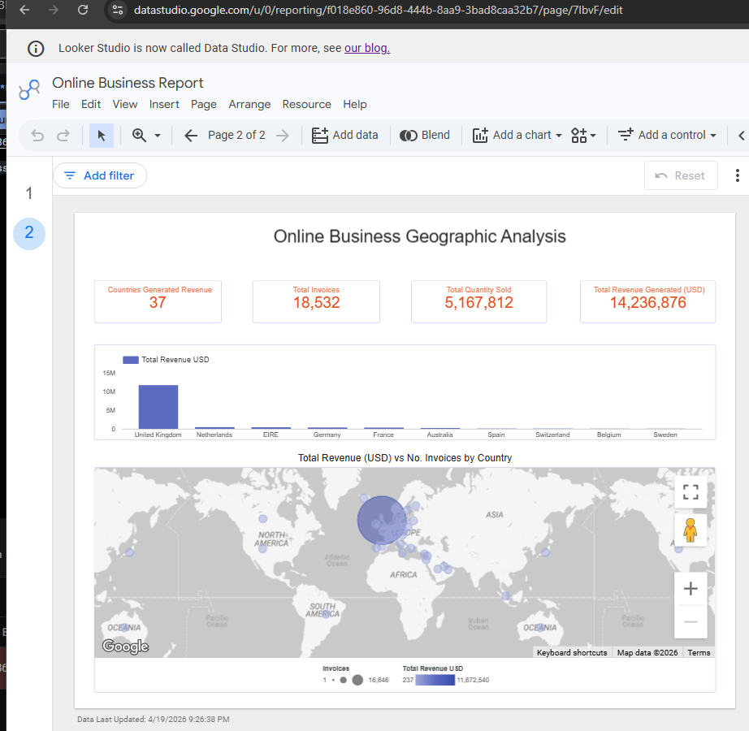

# Online Business Pipeline

An online business operates across multiple countries and accumulates transactional invoice data in flat CSV files. The business has no centralised analytics capability — data stored locally in different files, unvalidated, and unavailable for reporting. The goal of this project is to build an end-to-end batch data pipeline that ingests raw business data, connect with currency rates, coutries then transforms it into a dimensional model, validates data quality at each stage, and makes it available for business intelligence reporting in Google Data Studio.


## Problem Statement

A UK-based online retail business sells across 37 countries and generates thousands of invoice transactions per month. Despite this volume, the business had no analytics capability:

- **Siloed data** — transactional records existed only as flat CSV exports with no central storage
- **No currency normalisation** — all sales were recorded in GBP with no conversion to USD or EUR, making cross-market revenue comparison impossible
- **No data quality enforcement** — nulls, duplicates, and malformed records went undetected before reporting
- **No dimensional model** — raw invoice rows could not support questions like "which country drives the most revenue?" or "what is our best-selling product?" without ad-hoc SQL on every query
- **No automated pipeline** — loading, transforming, and validating data was a manual, error-prone process

## Solution

This project delivers a fully automated end-to-end ELT pipeline that turns raw CSV exports into a validated, analytics-ready dimensional model in BigQuery, refreshable on demand.

| Problem | Solution |
|---|---|
| Flat files with no central storage | Uploaded to Google Cloud Storage as the raw data lake |
| GBP-only revenue figures | Monthly GBP → USD and EUR exchange rates loaded and joined at the fact table level |
| No data quality enforcement | Soda Core checks gate every pipeline stage — raw load, transform, and report |
| No dimensional model | dbt builds a star schema: 4 dimensions + 1 fact table + 5 pre-aggregated report tables |
| Manual, error-prone process | Apache Airflow DAG orchestrates the full pipeline end-to-end with automatic failure handling |
| No business reporting | Google Data Studio dashboards connect directly to BigQuery report tables |

## Architecture

The pipeline follows an **ELT** pattern: raw data is landed in a cloud data lake first, then loaded into the data warehouse, and transformed in-place using dbt. Data quality checks run at each stage before the next begins.

```
┌──────────────┐    ┌────────────┐    ┌────────────────┐    ┌─────────────────┐    ┌─────────────────┐    ┌──────────────┐
│  Local CSV   │    │    GCS     │    │  BigQuery      │    │  BigQuery       │    │  BigQuery       │    │   Looker     │
│    Files     │───▶│  Data Lake │───▶│  Raw Layer     │───▶│  Transform      │───▶│  Report Layer   │───▶│   Studio     │
│              │    │            │    │                │    │  Layer          │    │                 │    │              │
│ invoices.csv │    │ raw/*.csv  │    │ raw_invoices   │    │ dim_customers   │    │ report_country  │    │  Dashboards  │
│ country.csv  │    │            │    │ raw_currency   │    │ dim_product     │    │ report_monthly  │    │  connected   │
│ currency.csv │    │            │    │ country        │    │ dim_datetime    │    │ report_customer │    │  to BigQuery │
└──────────────┘    └────────────┘    └───────┬────────┘    │ fct_invoices    │    │ report_product  │    └──────────────┘
                                              │             └────────┬────────┘    └────────┬────────┘
                                       Soda check_load        Soda check_transform    Soda check_report
                                       ✓ pass → next           ✓ pass → next           ✓ pass → next
                                       ✗ fail → stop           ✗ fail → stop           ✗ fail → stop
```


## Technologies


| Type | Tool | Location |
|---|---|---|
| Cloud | Google Cloud (GCS, BigQuery, IAM) | GCP |
| Orchestration | Apache Airflow 3.x (Astronomer Runtime) | Docker / Astro CLI |
| Infrastructure | Terraform | GCS bucket + BigQuery dataset |
| Batch processing | Python, Airflow DAG | `dags/` |
| Data Modelling | dbt Core 1.11 + Cosmos | `include/dbt/models/` |
| Data Warehouse | Google BigQuery | `online_business` dataset |
| Data Quality | Soda Core (`soda-core-bigquery`) | `include/soda/` |
| Visualisation | Google Data Studio (Looker Studio) | Connected to BigQuery report layer |


### Datasets 

1 online_business.csv 

Data loaded from https://www.kaggle.com/datasets/tunguz/online-retail and saved to include/dataset/online_business.csv 

Dataset Information:

This is a transnational data set which contains all the transactions occurring between 01/12/2010 and 09/12/2011 for a UK-based and registered non-store online retail.The company mainly sells unique all-occasion gifts. Many customers of the company are wholesalers.

Attribute Information:


| Field | Description |
|---|---|
| InvoiceNo | Invoice number. Nominal, a 6-digit integral number uniquely assigned to each transaction. If this code starts with letter 'c', it indicates a cancellation. |
| StockCode | Product (item) code. Nominal, a 5-digit integral number uniquely assigned to each distinct product. |
| Description | Product (item) name. Nominal. |
| Quantity | The quantities of each product (item) per transaction. Numeric. |
| InvoiceDate | Invoice date and time. The day and time when each transaction was generated. |
| UnitPrice | Unit price. Product price per unit in sterling. Numeric. |
| CustomerID | Customer number. Nominal, a 5-digit integral number uniquely assigned to each customer. |
| Country | Country name. Nominal, the name of the country where each customer resides. |

2 country.csv 


3 gbp_monthly_avg_2010_2026.csv

Run Dag  gbp_monthly_avg_to_gcs.py


## Project Structure

```
OnlineBusinessPipeline/
│
├── dags/
│   ├── online_business.py          
│   └── gbp_monthly_avg_to_gcs.py   
│
├── include/
│   ├── dataset/                   
│   │   ├── online_business.csv
│   │   ├── country.csv
│   │   └── raw_currency_rates_gbp_monthly_avg_2010_2026.csv
│   │
│   ├── dbt/                        
│   │   ├── models/
│   │   │   ├── sources/
│   │   │   │   └── sources.yml     
│   │   │   ├── transform/          
│   │   │   │   ├── dim_customers.sql
│   │   │   │   ├── dim_product.sql
│   │   │   │   ├── dim_datetime.sql
│   │   │   │   ├── dim_currency_rates.sql
│   │   │   │   └── fct_invoices.sql
│   │   │   └── report/             
│   │   │       ├── report_country_revenue.sql
│   │   │       ├── report_customer_segments.sql
│   │   │       ├── report_monthly_revenue.sql
│   │   │       ├── report_product_invoices.sql
│   │   │       └── report_product_performance.sql
│   │   ├── cosmos_config.py        
│   │   ├── dbt_project.yml
│   │   ├── profiles.yml            
│   │   └── packages.yml            
│   │
│   ├── soda/                       
│   │   ├── check_function.py       
│   │   ├── configuration.yml       
│   │   └── checks/
│   │       ├── sources/           
│   │       │   ├── raw_invoices.yml
│   │       │   ├── raw_currency_rates.yml
│   │       │   └── country.yml
│   │       ├── transform/          
│   │       │   ├── dim_customers.yml
│   │       │   ├── dim_product.yml
│   │       │   ├── dim_datetime.yml
│   │       │   ├── dim_currency_rates.yml
│   │       │   └── fct_invoices.yml
│   │       └── report/             
│   │           ├── report_monthly_revenue.yml
│   │           ├── report_product_performance.yml
│   │           ├── report_product_invoices.yml
│   │           └── report_customer_segments.yml
│   │
│   └── keys/                      
│       └── de-project-creds.json
│
├── Dockerfile                      
├── requirements.txt                
├── airflow_settings.yaml           
├── .env                          
└── .gitignore
```

## Data Models (dbt-core)

The dbt project implements a **star schema** in BigQuery. All models are materialised as physical tables in the `online_business` dataset.

### Dimensional Model

```
                        ┌──────────────────┐
                        │  dim_datetime    │
                        │  datetime_id  PK │
                        │  year            │
                        │  month           │
                        │  day / hour      │
                        │  weekday         │
                        └────────┬─────────┘
                                 │
┌──────────────────┐    ┌────────▼──────────────────────────────┐    ┌──────────────────┐
│  dim_customers   │    │              fct_invoices             │    │   dim_product    │
│  customer_id  PK │───►│  invoice_id                           │◄───│  product_id   PK │
│  country         │    │  datetime_id  FK                      │    │  stock_code      │
│  iso             │    │  product_id   FK                      │    │  description     │
└──────────────────┘    │  customer_id  FK                      │    │  price           │
                        │  quantity                             │    └──────────────────┘
                        │  total_invoice_gbp                    │
                        │  total_invoice_usd                    │    ┌──────────────────────┐
                        │  total_invoice_eur                    │◄───│  dim_currency_rates  │
                        └───────────────────────────────────────┘    │  year_month       PK │
                                                                     │  avg_rate_gbp_usd    │
                                                                     │  avg_rate_gbp_eur    │
                                                                     └──────────────────────┘
```

### Transform Models

| Model | Description |
|---|---|
| `dim_customers` | Distinct customers with surrogate key from `CustomerID + Country`. Joins to `country` table for ISO code. Excludes null customer IDs. |
| `dim_product` | Distinct products with surrogate key from `StockCode + Description + UnitPrice`. Excludes null codes and zero/negative prices. |
| `dim_datetime` | Parsed invoice timestamps with extracted year, month, day, hour, minute, weekday. Uses `SAFE.PARSE_DATETIME` with `COALESCE` across two date formats — malformed dates produce NULL instead of crashing. |
| `dim_currency_rates` | Distinct monthly GBP→USD and GBP→EUR exchange rates from `raw_currency_rates`. |
| `fct_invoices` | Central fact table joining all dimensions. Calculates `total = Quantity × UnitPrice` and converts to GBP, USD, EUR by matching `year_month` to currency rates. Excludes negative quantities (cancellations). |

### Report Models

| Model | Description |
|---|---|
| `report_country_revenue` | Revenue, invoice count, and quantity sold aggregated by country + ISO code. Ordered by GBP revenue desc. |
| `report_customer_segments` | Per-customer order count, quantity, revenue (3 currencies), and average order value in GBP. |
| `report_monthly_revenue` | Month-by-month invoice count, quantity, and revenue in GBP / USD / EUR. |
| `report_product_performance` | Per-product revenue and invoice count in all three currencies. |
| `report_product_invoices` | Per-product total quantity sold. |

### dbt Packages

| Package | Version | Usage |
|---|---|---|
| `dbt-labs/dbt_utils` | 1.3.3 | `generate_surrogate_key()` macro used in dim_customers, dim_product, fct_invoices |

## Data Quality testing (Soda-core)

Data quality is enforced at three points in the pipeline using [Soda Core](https://docs.soda.io/soda-core/overview-main.html) (`soda-core-bigquery`). Each check runs inside a dedicated `soda_venv` via `@task.external_python` to keep Soda's dependencies isolated from Airflow. If any check fails (exit code 2), the task raises an exception and the DAG stops — downstream dbt transforms never run on bad data.

### How it works

```
Airflow task (@task.external_python)
  └── soda_venv/bin/python
        └── include/soda/check_function.py :: check(scan_name, checks_subpath)
              ├── loads include/soda/configuration.yml   (BigQuery connection)
              └── loads include/soda/checks/<subpath>/   (check definitions)
```

### Check stages

| Airflow task | checks_subpath | Runs after | Purpose |
|---|---|---|---|
| `check_load` | `sources` | Raw BQ load | Validate raw table schema and nulls before any transformation |
| `check_transform` | `transform` | dbt transform | Validate dimensional model schema, uniqueness, and integrity |
| `check_report` | `report` | dbt report | Validate report tables before BI consumption |

### Checks per table

**Sources** — run after `gcs_*_to_bq_raw` tasks

| Table | Check type | Detail |
|---|---|---|
| `raw_invoices` | Schema | Required columns: InvoiceNo, StockCode, Quantity, InvoiceDate, UnitPrice, CustomerID, Country |
| `raw_invoices` | Schema | Column types: Quantity → integer, UnitPrice → float64, CustomerID → string, others → string |
| `raw_currency_rates` | Schema | Required columns: year_month, avg_rate_gpb_usd, avg_rate_gpb_eur |
| `raw_currency_rates` | Schema | Column types: year_month → string, rates → float64 |
| `country` | Nulls | No nulls in id, iso, nicename · row_count > 0 |

**Transform** — run after dbt transform models

| Table | Check type | Detail |
|---|---|---|
| `dim_customers` | Schema | Required columns: customer_id, country · types: string |
| `dim_customers` | Uniqueness | No duplicate customer_id values |
| `dim_customers` | Nulls | No nulls in customer_id |
| `fct_invoices` | Schema | Required columns: invoice_id, product_id, customer_id, datetime_id, quantity, total_invoice_gbp |
| `fct_invoices` | Schema | Column types: IDs → string, quantity → int, total_invoice_gbp → float64 |
| `fct_invoices` | Nulls | No nulls in invoice_id |
| `fct_invoices` | Custom SQL | No rows where total_invoice_gbp < 0 (catches unfiltered cancellations) |
| `dim_currency_rates` | Schema | Required columns: year_month, avg_rate_gpb_usd, avg_rate_gpb_eur · types: string / float64 |
| `dim_currency_rates` | Uniqueness | No duplicate year_month entries |
| `dim_currency_rates` | Custom SQL | No zero or negative exchange rates |

**Report** — run after dbt report models

| Table | Check type | Detail |
|---|---|---|
| `report_monthly_revenue` | Schema | Required columns: year, month, num_invoices, total_quantity, total_revenue_gbp, total_revenue_usd, total_revenue_eur |
| `report_monthly_revenue` | Row count | row_count > 0 |
| `report_monthly_revenue` | Nulls | No nulls in year · no nulls in month |
| `report_product_performance` | Schema | Required columns: stock_code, description, total_quantity_sold, num_invoices, total_revenue_gbp, total_revenue_usd, total_revenue_eur |
| `report_product_performance` | Nulls | No nulls in stock_code |
| `report_product_performance` | Custom SQL | No negative revenue |
| `report_customer_segments` | Schema | Required columns: customer_id, country, iso, num_orders, total_quantity, total_revenue_gbp/usd/eur, avg_order_value_gbp |
| `report_customer_segments` | Uniqueness | One row per customer_id |
| `report_customer_segments` | Nulls | No nulls in customer_id |
| `report_customer_segments` | Custom SQL | No negative avg_order_value_gbp |

### Adding new checks

Drop a `.yml` file into the relevant `include/soda/checks/<subpath>/` directory using [SodaCL syntax](https://docs.soda.io/soda-cl/soda-cl-overview.html). Soda picks up all `.yml` files in the directory automatically.

```yaml
checks for <table_name>:
  - schema:
      fail:
        when required column missing: [col1, col2]
        when wrong column type:
          col1: string
          col2: float64
  - missing_count(col1) = 0:
      name: Descriptive check name
  - failed rows:
      name: Custom business rule
      fail query: |
        SELECT id FROM <table_name> WHERE <condition>
```

Soda picks up all `.yml` files in the directory automatically — no code changes needed.


## Google Data Studio (Looker) reporting 




18,532 total invoices processed
5,167,812 total units sold across all orders
$14,236,876 total revenue generated in USD — the key business metric


Revenue Trend Over Time (2010–2011) — line chart

This tracks monthly revenue in three currencies simultaneously — EUR (blue), GBP (orange), and USD (purple). 

Number of Invoices (2010–2011) — bar chart

This compares invoice count month by month between 2011 (blue) and 2010 (orange). Key takeaways:


2011 invoices grow steadily across the year, starting around 1K in January and reaching nearly 2K by October

The growth trend in invoice count mirrors the revenue trend above, confirming the business is growing through more transactions, not just higher order values.



[Data Studio dashboard](https://datastudio.google.com/s/uBT4DbZvENc)


37 countries generated revenue — good international 

Revenue by Country 

The UK dominates overwhelmingly with ~$10M+ in revenue, while every other country is barely visible in comparison.


Total Revenue (USD) vs No. Invoices by Country

Circle colour intensity represents Total Revenue USD (up to $11,672,540)
The large dark bubble sitting over Western Europe is UK. The smaller, lighter bubbles scattered across Europe, North America, Asia and Australia represent the long-tail markets from the bar chart. The map legend confirms the largest revenue bubble reaches $11,672,540.


[Online Business Dashboard](https://datastudio.google.com/u/0/reporting/f018e860-96d8-444b-8aa9-3bad8caa32b7/page/p_mmdzr03u2d)


## Reproducibility Steps

### Step 1: Clone repo and configure

```
git clone git@github.com:roman-m-g/OnlineBusinessPipeline.git
cd OnlineBusinessPipeline


# create keys/ and copy service-account-key.json 
cp /path/to/your/service-account-key.json keys/de-project-creds.json
```

### Provision Infrastructure with Terraform (first time)
```
cd terraform
terraform init
terraform plan
terraform apply
```


## Prerequisites

```
1 Terraform installed
2 Docker and Docker Compose
3 Python 3.12+
4 GCP Account (billing enabled)
5 Service Account with roles: Storage Admin, BigQuery Admin
6 Service Account Key (JSON) saved as keys/de-project-creds.json
7 Google Data Studio
```

### Step 2: Install and setup Astro CLI

https://github.com/astronomer/astro-cli

Linux  Astro cli version v1.41.0
```
curl -sSL install.astronomer.io | sudo bash -s

astro dev init
```
add to .env
```
PROTOCOL_BUFFERS_PYTHON_IMPLEMENTATION=python
OPENLINEAGE_DISABLED=true
AIRFLOW__OPENLINEAGE__DISABLED=true
AIRFLOW__CORE__DAG_FILE_PROCESSOR_TIMEOUT=120
```

```
astro dev restart    -- astro dev start        -- astro dev stop
```

debug: if stale containers block startup, remove them manually then restart.
```
docker ps -a | grep airflow
docker rm <container_id>
astro dev restart
```


### Step 3: Get datasets and save to include/dataset/   

1 online_business.csv 

Data loaded from https://www.kaggle.com/datasets/tunguz/online-retail and saved to include/dataset/online_business.csv 

Updated Country   EIRE to Ireland  (8196) records and converted to utf-8 .


2 country.csv 


3 gbp_monthly_avg_2010_2026.csv

Run Dag  gbp_monthly_avg_to_gcs.py

Download from GCS bucket and save include/dataset/currency_rates_gbp_monthly_avg_2010_2026.csv 


### Step 4:  Airflow DAG Run

astro dev start  executed

Access Airflow UI at http://localhost:8080

Run below Dags


#### Currency rates GBP to USD & EUR 2010-2026 Dag

http://localhost:8080/dags/gbp_monthly_avg_to_gcs


###  Online Business Pipeline Dag

http://localhost:8080/dags/online_business/


### Step 5: Google Data Studio

- Open [DataStudio](https://datastudio.google.com)

- Create a new report → Data Source → BigQuery

- Connect to your project → online_busines dataset

- Add report_country_revenue, report_customer_segments, report_monthly_revenue, and report_product_performance tables

- Build the two-page dashboard


### Step 6: Clean up

```
astro dev stop 
```


```
cd terraform
terraform destroy
```


